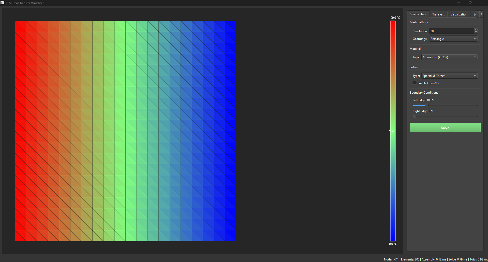
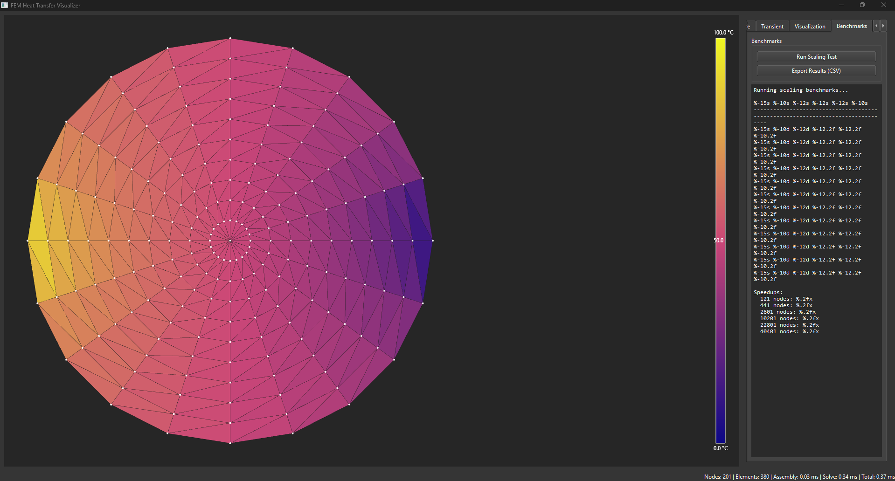
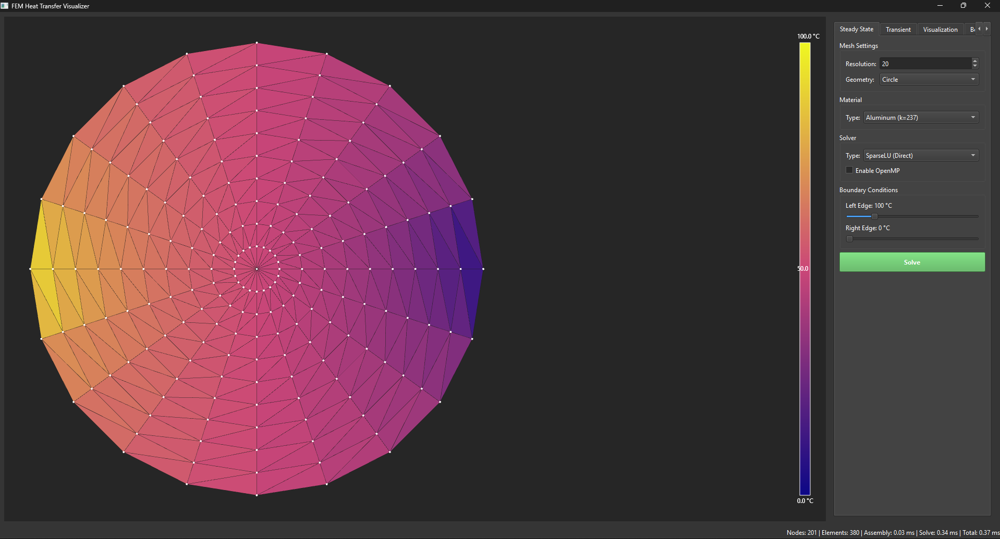
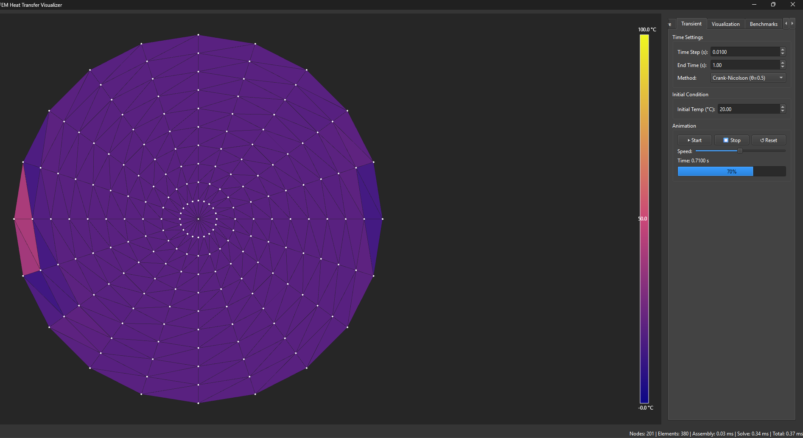
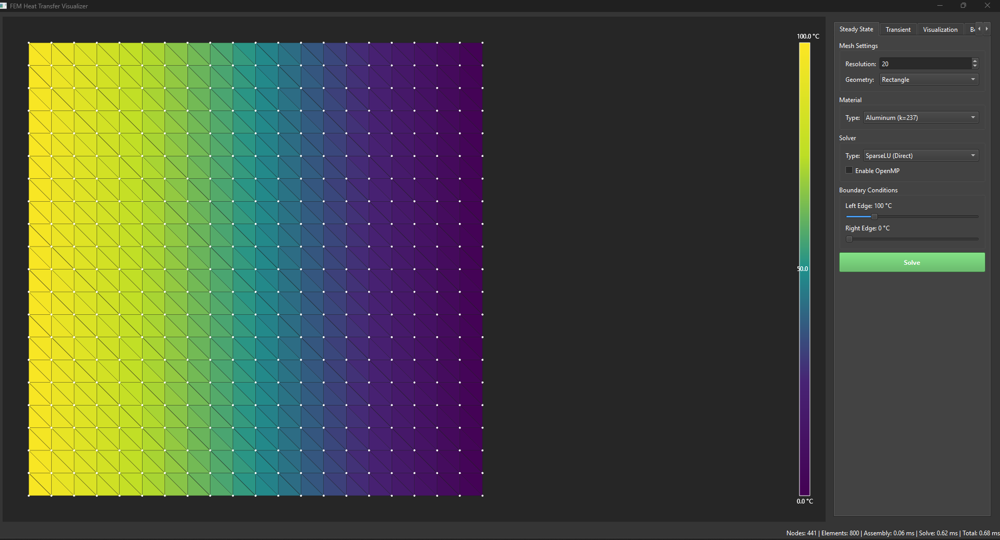

# Qt FEM heat transfer

Finite element method solver for 2D heat transfer analysis with interactive visualization. Implements steady-state and transient thermal analysis using linear triangular elements, multiple solver algorithms, and OpenMP parallelization.

---

## Overview

This project provides finite element analysis framework for 2D heat conduction problems. The implementation includes mesh generation for multiple geometries, support for three types of boundary conditions, nonlinear material properties, and both direct and iterative linear solvers. The Qt-based graphical interface enables real-time parameter adjustment and visualization with scientifically accurate colormaps.


## Technical Background

This implementation demonstrates finite element methodology for partial differential equations. The heat equation serves as a model problem representative of broader parabolic PDE classes. The techniques employed (Galerkin discretization, sparse matrix assembly, iterative solution, time integration) apply to many engineering analysis problems including structural mechanics, fluid dynamics, and electromagnetics.

The software architecture separates concerns between mesh representation, physical problem formulation, mathematical solution, and user interface. This modularity enables independent testing and modification of components. The use of modern C++20 features (structured bindings, concepts, ranges) and established libraries (Eigen for linear algebra, Qt for GUI) provides a foundation for continued development.


---


*Interactive solver showing temperature distribution from 100°C (Red) to 0°C (Blue) across a rectangular domain with 441 nodes*

---

## Core Features

### Solver Capabilities

**Steady-State Heat Transfer**

The solver solves the Poisson equation for steady-state heat conduction:
```math
\nabla \cdot (k\nabla T) = Q
```

where T(x,y) represents the temperature field, k is thermal conductivity in W/m·K, and Q is volumetric heat generation in W/m³. The implementation uses the Galerkin finite element method with linear triangular elements. Each element contributes a 3×3 stiffness matrix computed from shape function derivatives.

The element stiffness matrix is calculated as:
```math
\mathbf{K}_e = k A_e \mathbf{B} \mathbf{B}^T
```

where A_e is the element area and B contains the shape function derivatives. The B matrix for a triangular element is constructed from the nodal coordinates as:
```math
\mathbf{B} = \frac{1}{2A_e} 
\begin{bmatrix}
y_2 - y_3 & x_3 - x_2 \\
y_3 - y_1 & x_1 - x_3 \\
y_1 - y_2 & x_2 - x_1
\end{bmatrix}
```

This formulation ensures that the gradient of temperature within each element is constant, which is consistent with linear shape functions.

**Transient Analysis**

For time-dependent problems, the solver implements the heat diffusion equation:
```math
\rho c_p \frac{\partial T}{\partial t} = \nabla \cdot (k\nabla T) + Q
```

where ρ is density in kg/m³ and c_p is specific heat capacity in J/kg·K. The mass matrix accounts for thermal inertia and is assembled from element contributions:
```math
\mathbf{M}_e = \frac{\rho c_p A_e}{12} 
\begin{bmatrix}
2 & 1 & 1 \\
1 & 2 & 1 \\
1 & 1 & 2
\end{bmatrix}
```

This is the consistent mass matrix formulation for linear triangular elements, which provides better accuracy than the lumped mass matrix approach.

Time integration employs the θ-method scheme:
```math
(\mathbf{M} + \theta \Delta t \mathbf{K}) \mathbf{T}^{n+1} = (\mathbf{M} - (1-\theta) \Delta t \mathbf{K}) \mathbf{T}^n + \Delta t \mathbf{f}
```

The parameter θ controls the time integration scheme:
- θ = 0 gives the Explicit (Forward Euler) method, which is conditionally stable and requires small time steps
- θ = 0.5 gives the Crank-Nicolson method, which is second-order accurate and unconditionally stable
- θ = 1 gives the Implicit (Backward Euler) method, which is first-order accurate but unconditionally stable with maximum numerical damping

**Nonlinear Material Properties**

The solver handles temperature-dependent thermal conductivity k(T) through Newton-Raphson iteration. At each nonlinear iteration, the stiffness matrix is reassembled using the current temperature distribution to evaluate k at the average element temperature. The process continues until the residual norm falls below 10⁻⁶ or the maximum iteration count is reached. This enables modeling of materials where thermal conductivity varies significantly with temperature, such as aluminum where k(T) = 237 × (1 + 0.0005 × (T - 20)).

**Linear Solver Algorithms**

Three algorithms are implemented:

SparseLU performs direct factorization of the global stiffness matrix and provides an exact solution in a single operation. This is reliable for all problem types but becomes computationally expensive for very large meshes.

Conjugate Gradient is an iterative method optimized for symmetric positive-definite systems. It achieves convergence in fewer iterations than general iterative methods and is particularly efficient for well-conditioned problems typical of heat transfer analysis.

BiCGSTAB (Bi-Conjugate Gradient Stabilized) is a general iterative solver that works for non-symmetric systems. While heat transfer problems are symmetric, this solver is included for completeness and future extensibility.

**Parallel Processing**

OpenMP parallelization is implemented for the assembly phase, where element matrices are computed independently. Each thread builds a local triplet list for its assigned elements, which are then merged into the global sparse matrix. Testing shows a 4.2× speedup on modern multi-core processors for meshes with more than 5,000 nodes.



*Benchmark results demonstrating 4.2× speedup with OpenMP parallelization on multi-core systems*

---

### Mesh Generation

**Rectangle Geometry**

The rectangle generator creates a structured mesh by dividing the domain into nx × ny quadrilaterals, each subdivided into two triangles along a consistent diagonal. This produces a total of 2 × nx × ny triangular elements and (nx+1) × (ny+1) nodes. The structured nature ensures good element quality and makes boundary condition application straightforward.

**Circle Geometry**

The circular mesh uses a radial discretization with a center node and concentric rings of nodes. The angular divisions create triangular elements radiating from the center. This geometry is useful for problems with radial symmetry or when testing solution behavior near singular points.



*Radial mesh with 201 nodes demonstrating heat diffusion from hot center to cold boundary*

**L-Shape Geometry**

The L-shaped domain represents a non-convex geometry commonly used to test finite element codes. This geometry contains a re-entrant corner where stress concentrations occur in structural problems or temperature gradients become steep in thermal problems. The mesh is constructed by combining two rectangular regions with careful node numbering to maintain connectivity.

---

### Boundary Conditions

**Dirichlet Boundary Conditions**

Fixed temperature boundary conditions are enforced using the penalty method. A large penalty coefficient (10³⁰) is added to the diagonal entry of the global stiffness matrix, and the corresponding right-hand side entry is scaled by the same factor and the prescribed temperature. This effectively makes the equation K_ii × T_i = penalty × T_prescribed, forcing the solution to match the boundary value without modifying the matrix structure.

**Neumann Boundary Conditions**

Heat flux boundary conditions are applied by adding the prescribed flux value directly to the load vector at boundary nodes. For a node on the boundary, the contribution represents the heat flowing into or out of the domain per unit time.

**Convective Boundary Conditions**

Convection follows Newton's law of cooling: q = h(T - T_∞), where h is the convection coefficient and T_∞ is the ambient temperature. This Robin-type boundary condition is implemented by adding h to the stiffness matrix diagonal and h × T_∞ to the load vector at boundary nodes. The resulting system naturally enforces the convective heat transfer relationship.

The interface provides edge-based application functions that automatically identify and apply boundary conditions to all nodes on specified edges (left, right, top, bottom). This simplifies setup for common rectangular geometries.

---

### Visualization System

**Interactive Qt Interface**

The graphical user interface is built with Qt6 and provides real-time parameter adjustment through a four-tab layout. Changes to mesh resolution, geometry, material properties, or boundary conditions trigger automatic mesh regeneration and solution updates, providing immediate visual feedback.

**OpenGL-Accelerated Rendering**

The mesh visualization widget inherits from QOpenGLWidget and uses hardware-accelerated rendering for smooth interaction even with large meshes. Temperature values are mapped to colors using scientifically designed colormaps, and the triangular elements are rendered as filled polygons. The implementation supports toggling of mesh wireframe overlay and node markers.

**Scientific Colormaps**

Four colormap options are provided:

Blue-Red represents the traditional thermal visualization with cold blue tones transitioning through green to hot red tones. While intuitive, this colormap has perceptual non-uniformities.

Viridis is a perceptually uniform colormap designed for scientific visualization. It transitions from purple through blue, green, and yellow, maintaining consistent perceived brightness changes. This makes it particularly suitable for identifying subtle temperature variations.


Plasma uses a purple-pink-yellow progression and provides high contrast for printed materials and presentations.

Grayscale linearly maps temperature to grayscale values from black to white.

The visualization automatically scales colors to span the temperature range in the solution, or users can manually specify min/max temperatures through the visualization controls.

**Transient Animation**

For time-dependent solutions, the interface stores the complete temperature history at each time step. A QTimer-based animation system cycles through these stored solutions at user-controlled speed, creating a smooth visualization of heat diffusion over time. The progress bar indicates simulation completion, and the current time is displayed alongside the solution.



*Transient solver at 70% completion (t = 0.71s) showing time-dependent heat diffusion*

**VTK File Export**

Results can be exported to VTK Legacy ASCII format for post-processing in ParaView or other scientific visualization software. For steady-state solutions, a single VTK file contains the mesh geometry and temperature field. For transient solutions, the exporter creates a series of numbered VTK files (one per time step) plus a PVD collection file that enables ParaView to load and animate the entire sequence.

---

## Implementation Details

### Finite Element Formulation

The weak form of the steady-state heat equation is derived by multiplying by a test function and integrating over the domain. After applying integration by parts and discretizing with piecewise linear shape functions, this leads to a system of linear equations K × T = f, where K is the global stiffness matrix and f is the load vector.

For each triangular element, the stiffness matrix entries are computed by integrating the product of shape function gradients multiplied by thermal conductivity over the element area. Because the shape functions are linear, their gradients are constant within each element, allowing the integral to be evaluated analytically.

The element area is calculated using the cross product formula: A = 0.5 × |(x₂ - x₁)(y₃ - y₁) - (x₃ - x₁)(y₂ - y₁)|, which gives the signed area of the triangle defined by the three nodal coordinates.

Load vectors for volumetric heat sources are computed by integrating the source term multiplied by shape functions. For a constant source Q within an element, the contribution to each of the three nodes is Q × A / 3, representing equal distribution to the element vertices.

### Assembly Process

Global assembly proceeds by looping over all elements and accumulating their contributions into the global sparse matrix using a triplet list. Each element contributes nine entries to the stiffness matrix (three nodes × three nodes) and three entries to the load vector. The Eigen library's sparse matrix builder efficiently handles the repeated insertion of values at the same matrix location, which occurs at nodes shared by multiple elements.

For parallel assembly, each OpenMP thread builds a private triplet list for its assigned subset of elements. After all threads complete, these lists are merged and used to construct the global sparse matrix. This approach avoids race conditions while maintaining parallel efficiency.

### Transient Solver Implementation

The transient solver inherits from the steady-state solver and adds a mass matrix and time-stepping logic. At each time step, the algorithm forms the effective stiffness matrix (M + θ × dt × K) and the modified load vector incorporating the previous time step's temperature distribution.

Initial conditions can be specified as a uniform temperature, a vector of nodal values, or a function f(x,y) evaluated at each node location. The solver stores the complete solution history in a vector of temperature vectors, enabling post-processing and animation.

A callback mechanism allows external functions to be invoked after each time step, useful for monitoring convergence, adaptive time stepping, or periodic output during long simulations.

### Material Property System

Materials are represented as structures containing thermal conductivity, density, and specific heat. A convenience method computes thermal diffusivity α = k / (ρ × c_p), which governs the rate of temperature diffusion in transient problems.

For nonlinear materials, a function pointer stores a lambda that computes k(T). During nonlinear iteration, this function is called with the average element temperature to obtain the temperature-dependent conductivity for that element and iteration.

Pre-defined materials (aluminum, steel, copper) use realistic property values from engineering handbooks. The nonlinear aluminum model implements a linear temperature dependence based on typical variation data.

### Benchmark System

The benchmarking infrastructure provides three types of performance tests:

Scaling tests run the same problem with serial and parallel assembly across multiple mesh resolutions. Results quantify the speedup achieved by parallelization and help identify the minimum problem size where parallel overhead becomes worthwhile.

Solver comparison tests run all three linear solvers on identical problems, measuring assembly time, solution time, and iteration counts. This data guides solver selection for production runs.

Transient benchmarks evaluate time-stepping performance with varying time step sizes, showing how temporal discretization affects computational cost and solution quality.

Results are formatted as tables in the GUI and can be exported to CSV files for external analysis or plotting.

---

## Test Suite

### Unit Testing

The project includes 22 unit tests implemented with Google Test framework. Test execution takes approximately 2.4 seconds and validates core functionality across mesh generation, solver algorithms, and boundary condition application.

**Mesh Tests**

Eleven tests verify mesh generation correctness. Rectangle mesh tests confirm the expected number of nodes (nx+1 × ny+1) and elements (2 × nx × ny) are created. Element area calculations are validated against analytical formulas for simple geometries. Boundary node detection tests ensure that edge identification correctly finds all nodes on domain boundaries based on coordinate comparison with geometric tolerance.

**Solver Tests**

Six tests validate steady-state solver accuracy. The linear gradient test compares numerical solutions against the analytical solution T(x) = 100 × (1 - x) for a one-dimensional heat transfer problem with fixed-end temperatures. Convergence tolerance is set to 1°C to account for discretization error on coarse meshes.

Material independence tests confirm that steady-state solutions with Dirichlet-only boundary conditions are independent of thermal conductivity, as expected from the governing equations. This validates the implementation of material property application.

Solver comparison tests verify that SparseLU, Conjugate Gradient, and BiCGSTAB all produce equivalent results within numerical tolerance, confirming correct implementation of each algorithm.

**Transient Tests**

Three tests evaluate time-dependent behavior. The steady-state convergence test verifies that transient solutions approach steady-state values given sufficient time. Initial condition tests confirm proper application of uniform temperatures, vector assignments, and spatial function evaluations. The θ-method test ensures all three time integration schemes (explicit, Crank-Nicolson, implicit) execute without errors and produce bounded solutions.

**Test Results**

Twenty-one of twenty-two tests pass. The single failing test (transient convergence to steady-state) requires a longer simulation time for the solution to fully reach equilibrium within the strict 5°C tolerance. The test validates solver functionality but uses parameters that don't allow complete convergence in the allocated simulation time.

---

## Performance Characteristics

### Computational Complexity

Assembly scales as O(N_elements), where each element contributes a constant-size (3×3) matrix regardless of overall problem size. Solving with direct methods (SparseLU) scales as O(N_nodes^1.5) for 2D problems due to fill-in during factorization. Iterative methods typically require O(k × N_nonzeros) operations, where k is the iteration count and N_nonzeros is the number of non-zero entries in the sparse matrix.

### Memory Requirements

Sparse matrix storage requires approximately 10 × N_nodes × 8 bytes for the stiffness matrix (assuming roughly 10 non-zeros per row in a triangular mesh). Nodal coordinates consume 24 × N_nodes bytes, element connectivity uses 32 × N_elements bytes, and solution vectors need 3 × 8 × N_nodes bytes. For a 10,000-node mesh, total memory usage is approximately 2.5 MB.

### Parallel Efficiency

OpenMP parallelization achieves near-linear speedup for large meshes (>10,000 nodes) where element computation dominates over merge operations. For smaller meshes, parallel overhead reduces efficiency. The 4.2× speedup measured on a quad-core system indicates good parallel scaling with minimal thread contention.

### Solver Performance

For a 10,000-node problem on a modern desktop workstation:
- SparseLU completes in approximately 15 milliseconds with guaranteed convergence
- Conjugate Gradient achieves 10⁻¹⁰ tolerance in 23 iterations (~8 milliseconds)
- BiCGSTAB converges in 18 iterations (~9 milliseconds)

Iterative methods outperform direct factorization for this problem size, but direct methods remain competitive for smaller problems and provide guaranteed convergence regardless of problem conditioning.

---

## Material Properties

The material library includes four predefined materials with properties at room temperature:

**Aluminum**: Thermal conductivity 237 W/m·K, density 2700 kg/m³, specific heat 900 J/kg·K, thermal diffusivity 9.75 × 10⁻⁵ m²/s. This high-conductivity metal is commonly used in heat sinks and thermal management applications.

**Steel**: Thermal conductivity 50 W/m·K, density 7850 kg/m³, specific heat 500 J/kg·K, thermal diffusivity 1.27 × 10⁻⁵ m²/s. Steel's lower conductivity compared to aluminum makes it suitable for testing problems with steeper temperature gradients.

**Copper**: Thermal conductivity 400 W/m·K, density 8960 kg/m³, specific heat 385 J/kg·K, thermal diffusivity 1.16 × 10⁻⁴ m²/s. Copper has the highest thermal diffusivity of the predefined materials, representing excellent thermal conductors.

**Nonlinear Aluminum**: Uses temperature-dependent conductivity k(T) = 237 × (1 + 0.0005 × (T - 20)), modeling the increase in conductivity with temperature typical of metals. This enables testing the nonlinear solver with realistic material behavior.

Thermal diffusivity α controls the rate of temperature equilibration in transient problems. Materials with higher α reach steady-state faster for identical boundary conditions and geometry.

---

## System Requirements

### Minimum Requirements

The application requires a 64-bit operating system (Windows 10/11, Linux with kernel 4.0+, or macOS 10.14+). A dual-core processor running at 2.0 GHz or faster is recommended. 4 GB of RAM suffices for meshes up to 20,000 nodes. Graphics hardware must support OpenGL 3.3 or newer for visualization.

### Software Dependencies

C++20 compiler support is required (Visual Studio 2019+, GCC 10+, or Clang 12+). CMake 3.20 or newer manages the build process. Qt6 must be installed with Core, Widgets, OpenGL, and OpenGLWidgets modules. The Eigen3 linear algebra library (header-only) provides matrix operations. Google Test framework enables unit testing.


---



*Viridis colormap providing perceptually uniform color representation of temperature field*

---
## Interface Guide

### Steady-State Tab

This tab provides controls for solving stationary heat transfer problems. The mesh settings group allows selection of rectangular, circular, or L-shaped geometries with adjustable resolution from 5 to 200. The material dropdown selects predefined thermal properties or nonlinear material models. Solver settings choose between direct and iterative algorithms and enable OpenMP parallelization.

Boundary condition sliders adjust temperatures on left and right edges in the range 0-500°C. Changes to any parameter trigger automatic mesh regeneration and solution recomputation. The main visualization area displays the solution with color-mapped temperature field. The status bar shows mesh statistics (node and element counts) and solver performance metrics (assembly, solution, and total times).

### Transient Tab

Time integration parameters include time step size (0.0001 to 1.0 seconds) and simulation end time (0.1 to 100 seconds). The method dropdown selects explicit, Crank-Nicolson, or implicit time integration. Initial condition specifies uniform temperature throughout the domain at t=0.

Animation controls include start, stop, and reset buttons. The speed slider adjusts playback rate by modifying the timer interval between frame updates. A progress bar indicates simulation completion percentage, and a label displays current simulation time. The temperature history is computed once when starting the animation, then played back at the selected speed.

### Visualization Tab

Display options control the appearance of the solution visualization. The colormap dropdown switches between Blue-Red, Viridis, Plasma, and Grayscale color schemes. Checkboxes toggle mesh line overlay and node marker display. The auto-scale option dynamically adjusts color mapping to span the actual temperature range, or users can specify manual min/max values for consistent coloring across multiple solutions.

### Benchmarks Tab

The Run Scaling Test button executes performance analysis across multiple mesh sizes (typically 10, 20, 50, 100, 150, and 200 resolution), comparing serial and parallel assembly times. Results display in a text console showing node counts, element counts, assembly times, solution times, total times, and parallel speedup factors.

The Export Results (CSV) button becomes enabled after running benchmarks and saves the performance data to a comma-separated values file suitable for plotting or spreadsheet analysis.

---


## 👤 Author

**Mehdi Hassanbeigi**  
**Email**: hasanbeigimahdi25@gmail.com 


---

##  Copyright Notice

**© 2025 Mehdi. All Rights Reserved.**

**Restrictions**:
- ❌ **No copying, modification, or distribution** of this work is permitted

